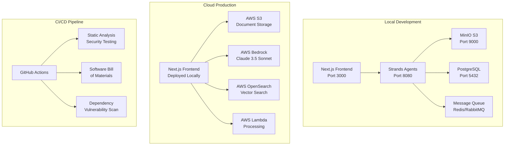

<!--
SPDX-License-Identifier: PolyForm-Perimeter-1.0.0
SPDX-FileCopyrightText: 2025 Seventeen Sierra LLC
-->

# Proposal Prepper Base App Design Document

## Overview

The Proposal Prepper base application is a federal contractor proposal compliance validation system that implements a hybrid deployment architecture with local Next.js frontend and cloud-based AWS backend services. The system provides automated FAR/DFARS compliance checking using AWS Bedrock (Claude 3.5 Sonnet) while maintaining OpenSSF Baseline Level 1 security compliance.

### Key Design Principles

1. **Hybrid Architecture**: Local development with cloud production deployment
2. **Security First**: OpenSSF Baseline Level 1 compliance from day one
3. **Developer Experience**: Full local development environment with Strands agents
4. **Microservice Architecture**: Clear separation between web frontend and AI backend services
5. **Compliance by Design**: Built-in compliance validation and audit trails

## Architecture

### System Architecture



### Service Architecture

The application follows a Federated Mesh architecture with these core services:

1. **Web Service** (Next.js) - Port 3000
   - User interface and frontend logic
   - API routes for client-server communication
   - Authentication and session management

2. **Strands Service** (Python) - Port 8080
   - AI agent orchestration and workflow management
   - Document processing and analysis
   - Compliance validation logic

3. **Data Layer**
   - **Local**: MinIO (S3-compatible), PostgreSQL, Redis/RabbitMQ
   - **Cloud**: AWS S3, OpenSearch, Lambda, Bedrock

## Components and Interfaces

### Frontend Components (Next.js)

#### Core UI Components
- **ProposalUpload**: File upload interface with drag-and-drop support
- **ComplianceReport**: Results display with severity indicators and citations
- **AIAssistant**: Chat interface for interactive compliance guidance
- **Dashboard**: Overview of proposals and validation status

#### Shared Components (@17sierra/ui)
- Leverages existing component library with 34 shadcn components
- Consistent design patterns and accessibility compliance
- Tailwind CSS with CSS custom properties for theming

### Backend Services

#### Strands Agent Architecture
```python
# Core agent structure for local development
from strands import Agent, Workflow

class FARComplianceAgent(Agent):
    """Agent for FAR/DFARS compliance validation"""
    
    def __init__(self):
        super().__init__(name="far-compliance")
        self.llm_client = self._setup_llm_client()
    
    async def validate_proposal(self, document_path: str) -> ComplianceResult:
        """Main validation workflow"""
        # Document extraction and analysis
        # FAR/DFARS rule application
        # Compliance determination with confidence scoring
        pass

class DocumentProcessor(Agent):
    """Agent for document parsing and extraction"""
    
    async def extract_content(self, document: bytes) -> DocumentContent:
        """Extract text, tables, and metadata from proposals"""
        pass
```

#### API Layer
```typescript
// Next.js API routes
// /api/proposals - Proposal management
// /api/validate - Compliance validation
// /api/results - Results retrieval
// /api/health - Health checks

interface ProposalValidationRequest {
  proposalId: string;
  validationType: 'far' | 'dfars' | 'combined';
  options?: ValidationOptions;
}

interface ComplianceResult {
  proposalId: string;
  overallScore: number;
  findings: ComplianceFinding[];
  recommendations: string[];
  confidence: number;
  timestamp: string;
}
```

## Data Models

### Core Data Structures

#### Proposal Document
```typescript
interface ProposalDocument {
  id: string;
  filename: string;
  uploadedAt: Date;
  size: number;
  contentType: string;
  s3Key: string; // or MinIO key for local
  metadata: {
    pageCount?: number;
    extractedText?: string;
    sections?: DocumentSection[];
  };
  status: 'uploaded' | 'processing' | 'analyzed' | 'error';
}
```

#### Compliance Finding
```typescript
interface ComplianceFinding {
  id: string;
  proposalId: string;
  ruleId: string; // FAR/DFARS reference
  severity: 'critical' | 'major' | 'minor' | 'info';
  title: string;
  description: string;
  citation: string; // Exact FAR/DFARS citation
  proposalText: string; // Relevant proposal excerpt
  recommendation: string;
  confidence: number; // 0-100
  aiReasoning: string;
}
```

#### SBOM (Software Bill of Materials)
```typescript
interface SBOMComponent {
  name: string;
  version: string;
  license: string;
  supplier: string;
  downloadLocation: string;
  filesAnalyzed: boolean;
  licenseConcluded: string;
  copyrightText: string;
  vulnerabilities?: CVEReference[];
}

interface SBOM {
  spdxVersion: string;
  creationInfo: {
    created: Date;
    creators: string[];
    licenseListVersion: string;
  };
  packages: SBOMComponent[];
  relationships: SBOMRelationship[];
}
```

### Database Schema (PostgreSQL for local development)

```sql
-- Proposals table
CREATE TABLE proposals (
    id UUID PRIMARY KEY DEFAULT gen_random_uuid(),
    filename VARCHAR(255) NOT NULL,
    uploaded_at TIMESTAMP DEFAULT NOW(),
    size BIGINT NOT NULL,
    content_type VARCHAR(100),
    s3_key VARCHAR(500),
    status VARCHAR(20) DEFAULT 'uploaded',
    metadata JSONB,
    created_at TIMESTAMP DEFAULT NOW(),
    updated_at TIMESTAMP DEFAULT NOW()
);

-- Compliance findings table
CREATE TABLE compliance_findings (
    id UUID PRIMARY KEY DEFAULT gen_random_uuid(),
    proposal_id UUID REFERENCES proposals(id),
    rule_id VARCHAR(50) NOT NULL,
    severity VARCHAR(20) NOT NULL,
    title VARCHAR(255) NOT NULL,
    description TEXT,
    citation VARCHAR(255),
    proposal_text TEXT,
    recommendation TEXT,
    confidence INTEGER CHECK (confidence >= 0 AND confidence <= 100),
    ai_reasoning TEXT,
    created_at TIMESTAMP DEFAULT NOW()
);

-- SBOM components table
CREATE TABLE sbom_components (
    id UUID PRIMARY KEY DEFAULT gen_random_uuid(),
    name VARCHAR(255) NOT NULL,
    version VARCHAR(100) NOT NULL,
    license VARCHAR(255),
    supplier VARCHAR(255),
    download_location TEXT,
    files_analyzed BOOLEAN DEFAULT FALSE,
    license_concluded VARCHAR(255),
    copyright_text TEXT,
    created_at TIMESTAMP DEFAULT NOW()
);
```

## Correctness Properties

*A property is a characteristic or behavior that should hold true across all valid executions of a system-essentially, a formal statement about what the system should do. Properties serve as the bridge between human-readable specifications and machine-verifiable correctness guarantees.*

### Acceptance Criteria Testing Prework

1.1 Upload and analyze proposals against FAR/DFARS requirements
  Thoughts: This is about the core functionality working across all proposal types and formats. We can generate random proposal documents and ensure the system can process them and return compliance results.
  Testable: yes - property

1.2 Clear user personas and use cases
  Thoughts: This is about product design and user experience, not a functional requirement that can be automatically tested.
  Testable: no

1.3 Intuitive and accessible interfaces
  Thoughts: This involves UI/UX design principles and accessibility compliance. We can test accessibility programmatically but "intuitive" is subjective.
  Testable: yes - property (for accessibility compliance)

1.4 Product accuracy and authority
  Thoughts: This is about the quality and reliability of compliance validation results. We can test accuracy against known compliance standards.
  Testable: yes - property

1.5 Containerized infrastructure for local development
  Thoughts: This is about infrastructure setup and deployment. We can test that containers start correctly and services are accessible.
  Testable: yes - property

1.6 Microservice architecture
  Thoughts: This is about system architecture and service boundaries. We can test that services communicate correctly and maintain independence.
  Testable: yes - property

1.7 Cloud data infrastructure
  Thoughts: This is about data storage and retrieval functionality. We can test data operations and consistency.
  Testable: yes - property

1.8 Infrastructure security controls
  Thoughts: This is about security configurations and controls. We can test security policies and access controls.
  Testable: yes - property

1.9 Well-defined data models including SBOM
  Thoughts: This is about data structure validation and SBOM generation. We can test data validation and SBOM completeness.
  Testable: yes - property

1.10 Comprehensive data security
  Thoughts: This is about data protection and secret management. We can test encryption and access controls.
  Testable: yes - property

1.11 Data migration and seeding capabilities
  Thoughts: This is about data management operations. We can test migration scripts and data seeding.
  Testable: yes - property

1.12 Hybrid deployment architecture
  Thoughts: This is about deployment configuration. We can test that both local and cloud deployments work correctly.
  Testable: yes - property

1.13 Local frontend deployment
  Thoughts: This is about frontend deployment and startup. We can test that the frontend starts and is accessible.
  Testable: yes - property

1.14 Cloud backend deployment
  Thoughts: This is about backend service deployment. We can test service availability and API responses.
  Testable: yes - property

1.15 Local development environment
  Thoughts: This is about development setup and tooling. We can test that development environment starts correctly.
  Testable: yes - property

1.16 Comprehensive unit testing
  Thoughts: This is about test coverage and quality. We can test that tests exist and pass.
  Testable: yes - property

1.17 End-to-end testing
  Thoughts: This is about complete workflow testing. We can test full user workflows.
  Testable: yes - property

1.18 Component testing
  Thoughts: This is about UI component testing. We can test component rendering and behavior.
  Testable: yes - property

1.19 Security testing
  Thoughts: This is about security validation and vulnerability scanning. We can test security controls and scan results.
  Testable: yes - property

1.20 AWS Bedrock integration
  Thoughts: This is about AI service integration. We can test API connectivity and response handling.
  Testable: yes - property

1.21 CI/CD automation
  Thoughts: This is about build and deployment automation. We can test pipeline execution and artifact generation.
  Testable: yes - property

1.22 OpenSSF Baseline Level 1 compliance
  Thoughts: This is about security compliance standards. We can test specific compliance requirements.
  Testable: yes - property

### Property Reflection

After reviewing all properties, I identify the following consolidations:
- Properties 1.5, 1.12, 1.13, 1.14, 1.15 can be combined into deployment architecture validation
- Properties 1.16, 1.17, 1.18, 1.19 can be combined into comprehensive testing validation
- Properties 1.9, 1.10, 1.11 can be combined into data management validation
- Property 1.22 encompasses several security-related properties and should be the primary security property

### Correctness Properties

**Property 1: Proposal processing completeness**
*For any* valid proposal document, the system should successfully process it and return compliance findings with confidence scores
**Validates: Requirements 1.1**

**Property 2: Accessibility compliance**
*For any* UI component, it should meet WCAG 2.1 AA accessibility standards with proper ARIA labels and keyboard navigation
**Validates: Requirements 1.3**

**Property 3: Compliance validation accuracy**
*For any* proposal analysis, the system should provide accurate FAR/DFARS compliance validation with proper citations and reasoning
**Validates: Requirements 1.4**

**Property 4: Service architecture integrity**
*For any* service communication, the microservices should maintain clear boundaries and communicate through well-defined APIs
**Validates: Requirements 1.6**

**Property 5: Data operations consistency**
*For any* data operation, the system should maintain data integrity across local and cloud storage with proper validation and SBOM tracking
**Validates: Requirements 1.7, 1.9, 1.10, 1.11**

**Property 6: Deployment architecture reliability**
*For any* deployment configuration, the system should successfully deploy and operate in both local development and cloud production environments
**Validates: Requirements 1.5, 1.12, 1.13, 1.14, 1.15**

**Property 7: Comprehensive testing coverage**
*For any* code component, it should have appropriate unit, integration, component, and security tests with passing results
**Validates: Requirements 1.16, 1.17, 1.18, 1.19**

**Property 8: AI service integration reliability**
*For any* AI processing request, the system should successfully integrate with AWS Bedrock and handle responses, errors, and rate limiting appropriately
**Validates: Requirements 1.20**

**Property 9: CI/CD pipeline completeness**
*For any* code change, the CI/CD pipeline should execute SAST, dependency scanning, and SBOM generation successfully
**Validates: Requirements 1.21**

**Property 10: OpenSSF Baseline compliance**
*For any* security requirement, the system should meet OpenSSF Baseline Level 1 standards including dependency scanning, SAST, secret management, SBOM maintenance, and vulnerability disclosure
**Validates: Requirements 1.22**

## Error Handling

### Error Categories

1. **User Input Errors**
   - Invalid file formats
   - File size limits exceeded
   - Malformed requests

2. **System Errors**
   - Service unavailability
   - Database connection failures
   - Storage access issues

3. **AI Service Errors**
   - AWS Bedrock rate limiting
   - Model processing failures
   - Confidence threshold violations

4. **Security Errors**
   - Authentication failures
   - Authorization violations
   - Secret exposure attempts

### Error Response Format

```typescript
interface ErrorResponse {
  error: {
    code: string;
    message: string;
    details?: any;
    timestamp: string;
    requestId: string;
  };
}
```

## Testing Strategy

### Dual Testing Approach

The system implements both unit testing and property-based testing as complementary approaches:

- **Unit tests** verify specific examples, edge cases, and error conditions
- **Property tests** verify universal properties that should hold across all inputs
- Together they provide comprehensive coverage: unit tests catch concrete bugs, property tests verify general correctness

### Property-Based Testing

Using **fast-check** for JavaScript/TypeScript property-based testing with minimum 100 iterations per test.

Each property-based test must be tagged with: `**Feature: base-app, Property {number}: {property_text}**`

### Unit Testing

- Component-level testing for individual functions and modules
- Integration testing for service interactions
- End-to-end testing for complete user workflows
- Security testing for vulnerability validation

### Testing Configuration

- **Framework**: Vitest for unit tests, Playwright for E2E tests, fast-check for property tests
- **Coverage**: Minimum 80% code coverage for core functionality
- **CI Integration**: All tests run in GitHub Actions pipeline
- **Security Testing**: SAST tools integrated in CI/CD pipeline

## Security Architecture

### OpenSSF Baseline Level 1 Implementation

1. **Dependency Management**
   - Automated vulnerability scanning with npm audit
   - Dependency pinning in package-lock.json
   - Regular security updates through Renovate

2. **Static Analysis Security Testing (SAST)**
   - ESLint security rules
   - Semgrep for security pattern detection
   - CodeQL analysis in GitHub Actions

3. **Secret Management**
   - Environment variables for all secrets
   - No secrets committed to version control
   - Secret scanning with gitleaks

4. **Software Bill of Materials (SBOM)**
   - Automated SBOM generation with syft
   - SPDX format compliance
   - Vulnerability tracking for all components

5. **Vulnerability Disclosure**
   - SECURITY.md file with disclosure process
   - Security contact information
   - Response time commitments

### Data Protection

- **Encryption**: AES-256 for data at rest, TLS 1.3 for data in transit
- **Access Controls**: Role-based access with JWT tokens
- **Audit Logging**: Comprehensive audit trails for all data access
- **Data Minimization**: Only collect necessary data for compliance validation

## Performance Considerations

### Local Development Optimization

- **Resource Limits**: Configured for laptop deployment
- **Caching**: Redis for session and result caching
- **Database**: PostgreSQL with optimized queries
- **File Storage**: MinIO with efficient object storage

### Cloud Production Scaling

- **Auto-scaling**: AWS Lambda for serverless processing
- **CDN**: CloudFront for static asset delivery
- **Database**: RDS with read replicas for scaling
- **Monitoring**: CloudWatch for performance metrics

## Deployment Strategy

### Local Development Environment

```yaml
# docker-compose.yml structure
version: '3.8'
services:
  web:
    build: .
    ports: ["3000:3000"]
    environment:
      - NODE_ENV=development
  
  strands:
    build: ./strands
    ports: ["8080:8080"]
    depends_on: [postgres, minio, redis]
  
  postgres:
    image: postgres:15
    ports: ["5432:5432"]
    volumes: [postgres_data:/var/lib/postgresql/data]
  
  minio:
    image: minio/minio
    ports: ["9000:9000", "9001:9001"]
    command: server /data --console-address ":9001"
  
  redis:
    image: redis:7
    ports: ["6379:6379"]
```

### Cloud Production Deployment

- **Frontend**: Next.js deployed locally, connecting to AWS services
- **Backend**: AWS Lambda functions for processing
- **Storage**: S3 for documents, OpenSearch for search
- **AI**: AWS Bedrock for Claude 3.5 Sonnet integration
- **Infrastructure**: CDK/CloudFormation for reproducible deployments

## Monitoring and Observability

### Health Checks

- Service health endpoints for all components
- Database connection monitoring
- External service availability checks
- Resource utilization tracking

### Logging Strategy

- Structured logging with JSON format
- Centralized log aggregation
- Security event logging
- Performance metrics collection

### Alerting

- Service availability alerts
- Error rate thresholds
- Security incident notifications
- Performance degradation warnings