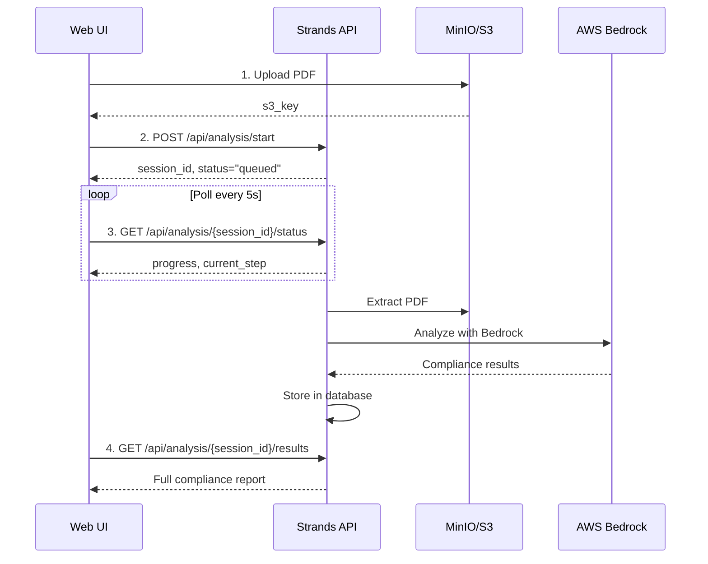

# API Integration Guide - Connecting to the GovCheck UI

> **For Backend Developers**: This guide explains how to integrate your backend services with the existing GovCheck web UI.

## Table of Contents

1. [Architecture Overview](#architecture-overview)
2. [API Endpoints](#api-endpoints)
3. [Data Models](#data-models)
4. [Integration Flow](#integration-flow)
5. [Testing Your Integration](#testing-your-integration)
6. [Error Handling](#error-handling)

---

## Architecture Overview

The GovCheck application uses a **federated mesh microservices** architecture:

```
┌─────────────────┐
│   Web UI        │ ← Your team works here
│   (Next.js)     │    Frontend interface
│   Port 3000     │
└────────┬────────┘
         │
         │ HTTP/REST
         │
┌────────▼────────┐
│  Strands API    │ ← Backend team integrates here
│  (Python/FastAPI)
│  Port 8080      │
└────────┬────────┘
         │
    ┌────┴────┬────────┬─────────┐
    │         │        │         │
┌───▼───┐ ┌──▼───┐ ┌──▼───┐ ┌──▼────┐
│Postgres│ │Redis │ │MinIO │ │Bedrock│
│  DB    │ │Cache │ │  S3  │ │  AI   │
└────────┘ └──────┘ └──────┘ └───────┘
```

### Service Communication

**Web UI → Strands API:**
- Protocol: HTTP/REST
- Base URL: `http://localhost:8080` (development)
- Base URL: `http://strands:8080` (Docker internal)
- Authentication: None (currently - add JWT/API keys in production)

**Strands API → Web UI:**
- Callbacks: Optional webhook URLs for async notifications
- Server-Sent Events (SSE): For real-time progress updates (future)

---

## API Endpoints

### Base URL

```
Development: http://localhost:8080
Production:  https://api.yourproduction.com
```

All endpoints are prefixed with `/api/` for the Web UI proxy.

### 1. Health Check

**Endpoint**: `GET /api/health`

**Purpose**: Verify service availability and status

**Response**:
```json
{
  "status": "healthy" | "degraded" | "unhealthy",
  "service": "strands",
  "version": "1.0.0",
  "timestamp": "2024-12-14T19:33:42.123Z",
  "environment": "development",
  "checks": {
    "database": "healthy",
    "redis": "healthy",
    "s3": "healthy",
    "aws_bedrock": "healthy" | "unavailable"
  }
}
```

**Usage in Web UI**:
```typescript
const response = await fetch('/api/health');
const health = await response.json();

if (health.status !== 'healthy') {
  // Show degraded service warning
}
```

---

### 2. Start Analysis

**Endpoint**: `POST /api/analysis/start`

**Purpose**: Submit a document for compliance analysis

**Request Body**:
```typescript
{
  "document_id": string,        // UUID for the document
  "filename": string,           // Original filename (e.g., "proposal.pdf")
  "s3_key": string,            // S3/MinIO object key
  "analysis_type": "compliance" | "full",  // Default: "compliance"
  "priority": "low" | "normal" | "high",   // Default: "normal"
  "callback_url"?: string      // Optional webhook for completion notification
}
```

**Response** (200 OK):
```typescript
{
  "success": true,
  "session_id": string,         // Track this ID for status checks
  "status": "queued" | "started",
  "estimated_completion": "2024-12-14T19:40:00.000Z" | null,
  "message": "Analysis started successfully"
}
```

**cURL Example**:
```bash
curl -X POST http://localhost:8080/api/analysis/start \
  -H "Content-Type: application/json" \
  -d '{
    "document_id": "550e8400-e29b-41d4-a716-446655440000",
    "filename": "nsf_proposal_2024.pdf",
    "s3_key": "uploads/550e8400-e29b-41d4-a716-446655440000.pdf",
    "analysis_type": "compliance",
    "priority": "normal"
  }'
```

**Web UI Integration**:
```typescript
// src/services/strands-api-client.ts
export async function startAnalysis(request: AnalysisStartRequest) {
  const response = await fetch('/api/analysis/start', {
    method: 'POST',
    headers: { 'Content-Type': 'application/json' },
    body: JSON.stringify(request)
  });
  
  if (!response.ok) {
    throw new Error(`Analysis start failed: ${response.statusText}`);
  }
  
  return await response.json() as AnalysisStartResponse;
}
```

---

### 3. Get Analysis Status

**Endpoint**: `GET /api/analysis/{session_id}/status`

**Purpose**: Poll for analysis progress

**Path Parameters**:
- `session_id` (string): Session ID from start analysis response

**Response** (200 OK):
```typescript
{
  "success": true,
  "session_id": string,
  "status": "queued" | "extracting" | "analyzing" | "completed" | "failed",
  "progress": number,           // 0-100
  "current_step": string,       // Human-readable description
  "started_at": string,         // ISO 8601 timestamp
  "completed_at": string | null,
  "estimated_completion": string | null,
  "error_message": string | null  // Only present if status === "failed"
}
```

**Example Polling Loop**:
```typescript
async function pollAnalysisStatus(sessionId: string): Promise<AnalysisStatusResponse> {
  const maxAttempts = 60; // 5 minutes max (60 * 5s intervals)
  
  for (let attempt = 0; attempt < maxAttempts; attempt++) {
    const response = await fetch(`/api/analysis/${sessionId}/status`);
    const status = await response.json();
    
    if (status.status === 'completed') {
      return status;
    }
    
    if (status.status === 'failed') {
      throw new Error(status.error_message || 'Analysis failed');
    }
    
    // Wait 5 seconds before next poll
    await new Promise(resolve => setTimeout(resolve, 5000));
  }
  
  throw new Error('Analysis timeout - exceeded maximum wait time');
}
```

---

### 4. Get Analysis Results

**Endpoint**: `GET /api/analysis/{session_id}/results`

**Purpose**: Retrieve completed analysis results

**Path Parameters**:
- `session_id` (string): Session ID from start analysis response

**Response** (200 OK):
```typescript
{
  "success": true,
  "results": {
    "id": string,
    "session_id": string,
    "document_id": string,
    "status": "pass" | "fail" | "warning",
    "issues": [
      {
        "id": string,
        "severity": "critical" | "warning" | "info",
        "title": string,
        "description": string,
        "regulation": {
          "regulation": "FAR" | "DFARS" | "NSF PAPPG",
          "section": string,
          "title": string,
          "url": string | null
        },
        "location": {
          "page": number | null,
          "section": string | null,
          "line": number | null,
          "context": string | null
        },
        "remediation": string | null,
        "confidence": number  // 0.0 - 1.0
      }
    ],
    "summary": {
      "total_issues": number,
      "critical_count": number,
      "warning_count": number,
      "info_count": number,
      "overall_score": number,  // 0-100
      "pass_threshold": number  // Default: 80.0
    },
    "generated_at": string,      // ISO 8601
    "ai_model": string,
    "processing_time": number,   // Seconds
    "metadata": {
      // Additional custom metadata
    }
  },
  "message": string
}
```

**Response** (404 Not Found):
```typescript
{
  "success": false,
  "results": null,
  "message": "No results found for session {session_id}"
}
```

**cURL Example**:
```bash
curl http://localhost:8080/api/analysis/550e8400-e29b-41d4-a716-446655440000/results
```

---

### 5. Cancel Analysis

**Endpoint**: `DELETE /api/analysis/{session_id}/cancel`

**Purpose**: Cancel a queued or running analysis

**Response**:
```typescript
{
  "success": true,
  "message": "Analysis cancelled successfully"
}
```

---

### 6. Processing Status (Admin)

**Endpoint**: `GET /api/processing/status`

**Purpose**: Get queue and worker statistics

**Response**:
```typescript
{
  "success": true,
  "status": {
    "queue_size": number,
    "active_analyses": number,
    "completed_today": number,
    "failed_today": number,
    "avg_processing_time": number,  // Seconds
    "workers": {
      "total": number,
      "busy": number,
      "idle": number
    }
  },
  "timestamp": string
}
```

---

### 7. Seed Data Endpoints (Development)

**Get Seeding Status**: `GET /api/seed/status`
**Get Seeded Documents**: `GET /api/seed/documents`
**Force Reseed**: `POST /api/seed/reseed`
**Verify Files**: `GET /api/seed/verify`

---

## Data Models

### TypeScript Definitions

Create these types in your frontend:

```typescript
// src/types/strands-api.ts

export interface AnalysisStartRequest {
  document_id: string;
  filename: string;
  s3_key: string;
  analysis_type: 'compliance' | 'full';
  priority: 'low' | 'normal' | 'high';
  callback_url?: string;
}

export interface AnalysisStartResponse {
  success: boolean;
  session_id: string;
  status: 'queued' | 'started';
  estimated_completion: string | null;
  message: string;
}

export interface AnalysisStatusResponse {
  success: boolean;
  session_id: string;
  status: 'queued' | 'extracting' | 'analyzing' | 'completed' | 'failed';
  progress: number;
  current_step: string;
  started_at: string;
  completed_at: string | null;
  estimated_completion: string | null;
  error_message: string | null;
}

export interface ComplianceIssue {
  id: string;
  severity: 'critical' | 'warning' | 'info';
  title: string;
  description: string;
  regulation: {
    regulation: string;
    section: string;
    title: string;
    url: string | null;
  };
  location: {
    page: number | null;
    section: string | null;
    line: number | null;
    context: string | null;
  } | null;
  remediation: string | null;
  confidence: number;
}

export interface ComplianceSummary {
  total_issues: number;
  critical_count: number;
  warning_count: number;
  info_count: number;
  overall_score: number;
  pass_threshold: number;
}

export interface ComplianceResults {
  id: string;
  session_id: string;
  document_id: string;
  status: 'pass' | 'fail' | 'warning';
  issues: ComplianceIssue[];
  summary: ComplianceSummary;
  generated_at: string;
  ai_model: string;
  processing_time: number;
  metadata: Record<string, unknown>;
}

export interface AnalysisResultsResponse {
  success: boolean;
  results: ComplianceResults | null;
  message: string;
}
```

---

## Integration Flow

### Complete Document Analysis Flow



### Step-by-Step Integration

**1. Upload Document (Web UI)**

```typescript
// File upload to MinIO/S3
async function uploadDocument(file: File): Promise<string> {
  const formData = new FormData();
  formData.append('file', file);
  
  const response = await fetch('/api/upload', {
    method: 'POST',
    body: formData
  });
  
  const { s3_key } = await response.json();
  return s3_key;
}
```

**2. Start Analysis**

```typescript
const s3_key = await uploadDocument(file);

const startRequest: AnalysisStartRequest = {
  document_id: crypto.randomUUID(),
  filename: file.name,
  s3_key,
  analysis_type: 'compliance',
  priority: 'normal'
};

const { session_id } = await startAnalysis(startRequest);
```

**3. Poll for Progress**

```typescript
const status = await pollAnalysisStatus(session_id);
// Update UI with progress bar, status messages
```

**4. Display Results**

```typescript
const { results } = await getAnalysisResults(session_id);

// Show:
// - Overall score
// - Critical/warning/info counts
// - List of issues with details
// - Remediation suggestions
```

---

## Testing Your Integration

### 1. Test Health Check

```bash
curl http://localhost:8080/api/health
```

Expected: `{"status": "healthy", ...}`

### 2. Test Complete Flow

Use the provided test script:

```bash
# Start the application
cd containers && ./start.sh -d

# Run integration test
cd ../
pnpm test:integration
```

### 3. Manual Testing via Web UI

1. Start application: `cd containers && ./start.sh -d`
2. Open: [http://localhost:3000](http://localhost:3000)
3. Click "New Compliance Check"
4. Upload test PDF from `src/seed-data/`
5. Watch status updates
6. View results page

### 4. API Testing with Postman/Insomnia

Import this collection:

```json
{
  "name": "GovCheck API",
  "requests": [
    {
      "name": "Health Check",
      "method": "GET",
      "url": "{{baseUrl}}/api/health"
    },
    {
      "name": "Start Analysis",
      "method": "POST",
      "url": "{{baseUrl}}/api/analysis/start",
      "body": {
        "document_id": "{{$guid}}",
        "filename": "test.pdf",
        "s3_key": "uploads/test.pdf",
        "analysis_type": "compliance"
      }
    },
    {
      "name": "Get Status",
      "method": "GET",
      "url": "{{baseUrl}}/api/analysis/{{sessionId}}/status"
    },
    {
      "name": "Get Results",
      "method": "GET",
      "url": "{{baseUrl}}/api/analysis/{{sessionId}}/results"
    }
  ],
  "variables": {
    "baseUrl": "http://localhost:8080"
  }
}
```

---

## Error Handling

### Standard Error Response

All errors return this format:

```typescript
{
  "success": false,
  "error": string,              // Human-readable error message
  "code": string,               // Machine-readable error code
  "timestamp": string,          // ISO 8601
  "service": "strands",
  "request_id": string,         // For tracing/debugging
  "details"?: Record<string, unknown>  // Additional context
}
```

### Common Error Codes

| Code | HTTP Status | Description | Action |
|------|-------------|-------------|---------|
| `SESSION_NOT_FOUND` | 404 | Session ID doesn't exist | Verify session_id is correct |
| `DOCUMENT_NOT_FOUND` | 404 | S3 object not found | Re-upload document |
| `ANALYSIS_IN_PROGRESS` | 409 | Analysis already running | Wait for completion |
| `INVALID_DOCUMENT` | 400 | PDF parsing failed | Check PDF is valid |
| `AWS_SERVICE_ERROR` | 503 | Bedrock unavailable | Falls back to mock analysis |
| `DATABASE_ERROR` | 500 | Database connection failed | Check database health |
| `TIMEOUT_ERROR` | 504 | Analysis exceeded timeout | Retry with higher timeout |

### Error Handling Example

```typescript
async function safeStartAnalysis(request: AnalysisStartRequest) {
  try {
    return await startAnalysis(request);
  } catch (error) {
    if (error instanceof Response) {
      const errorData = await error.json();
      
      switch (errorData.code) {
        case 'SESSION_NOT_FOUND':
          // Redirect to upload page
          break;
        case 'AWS_SERVICE_ERROR':
          // Show "Using mock analysis" warning
          break;
        case 'TIMEOUT_ERROR':
          // Offer retry with extended timeout
          break;
        default:
          // Generic error message
          console.error('Analysis failed:', errorData);
      }
    }
    throw error;
  }
}
```

---

## CORS Configuration

The Strands API allows requests from:

```python
# services/strands/main.py
allow_origins = [
    "http://localhost:3000",      # Local development
    "http://web:3000",            # Docker internal
    settings.web_service_url      # Configured in .env
]
```

For production, update `WEB_SERVICE_URL` in `.env`:

```bash
WEB_SERVICE_URL=https://your-production-frontend.com
```

---

## Rate Limiting

Current limits (development):
- **Max concurrent analyses**: 5
- **Analysis timeout**: 300 seconds (5 minutes)
- **Queue size**: Unlimited

Configure in `.env`:

```bash
MAX_CONCURRENT_ANALYSES=5
ANALYSIS_TIMEOUT_SECONDS=300
```

---

## WebSocket Support (Future)

Planned features for real-time updates:

- Server-Sent Events (SSE) for progress streaming
- WebSocket connections for bi-directional communication
- Real-time notifications for completed analyses

Current recommendation: Use polling with exponential backoff.

---

## Support

**Questions?**
- API Documentation: [http://localhost:8080/docs](http://localhost:8080/docs) (FastAPI Swagger UI)
- Check existing client: `src/services/strands-api-client.ts`
- Review tests: `src/services/strands-api-client.test.ts`

**Issues?**
- Check service logs: `docker-compose -p govcheck logs strands`
- Verify health: `curl http://localhost:8080/api/health`
- See [DEPLOYMENT.md](./DEPLOYMENT.md) troubleshooting section
