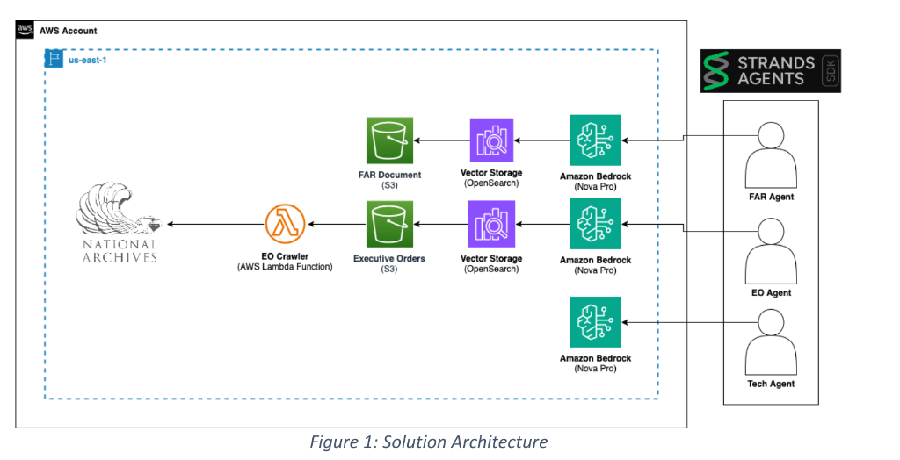
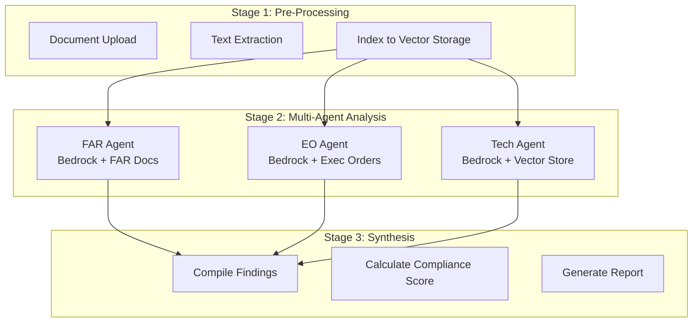
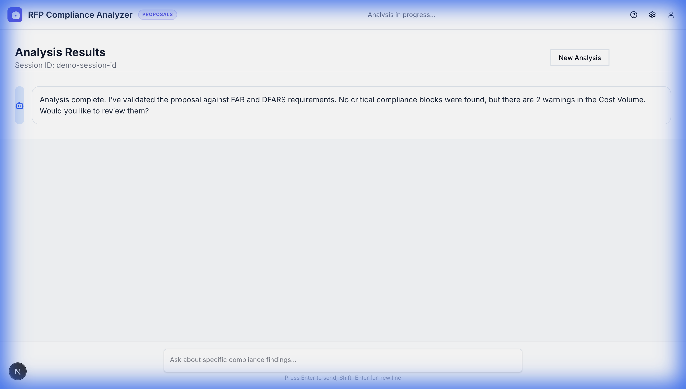

# Dual-Path Architecture Roadmap

## 1. Core Principle

Demo and Real modes use the **same UI** but differ in backend execution:

| Mode | Backend | Agent Behavior |
|------|---------|----------------|
| **Demo** | Mock Service | Simulated agent steps |
| **Real** | Strands SDK | 3 AI agents conversing |

---

## 2. Solution Architecture (Real Mode)

### The 3 Agents

| Agent | Data Source | Purpose |
|-------|-------------|---------|
| **FAR Agent** | FAR Documents (S3) + Vector Storage | Federal Acquisition Regulation compliance |
| **EO Agent** | Executive Orders (S3) + National Archives Crawler | Executive Order cross-reference |
| **Tech Agent** | Vector Storage | Technical requirements analysis |

Each agent uses **Amazon Bedrock (Nova Pro)** for AI inference.

---

## 3. Analysis Stages

| Stage | Demo/Mock | Real/Strands |
|-------|-----------|--------------|
| **Pre-Processing** | Instant simulation | Real S3 + OpenSearch |
| **Multi-Agent Analysis** | Animated steps | FAR/EO/Tech agents on Bedrock |
| **Synthesis** | Mock compliance score | AI-generated findings |

---

## 4. Demo Mode Visual: Blue Glow Frame

Blue glow "captive portal" effect when in demo mode.

---

## 5. Testing Strategy

| Level | Approach |
|-------|----------|
| **Component** | Storybook stories (mock vs real) |
| **Section** | Storybook for analysis stages |
| **Page** | Storybook full page |
| **E2E** | Heavy browser automation |

---

## 6. Implementation Phases

1. **Mesh Router Mode Routing** - Route demo→mock, real→strands
2. **Analysis Stages UI** - 3-stage display matching agent architecture
3. **Demo Glow Frame** - Blue captive portal effect
4. **E2E Tests** - Autonomous browser testing
