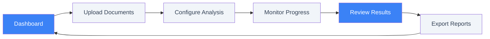
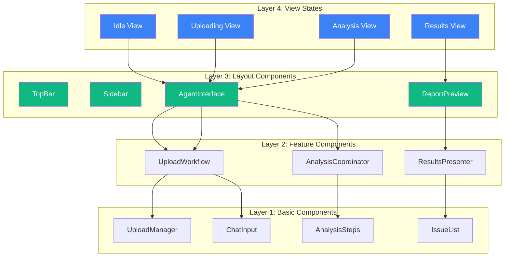

# User Journey & E2E Testing Plan

> Based on [Threshold Design Document](.kiro/specs/threshold/base/design.md)

---

## Core User Journey

The Proposal Prepper frontend provides a streamlined workflow for federal contractors:

1. **Upload**: Drag-and-drop document upload with real-time validation and progress tracking
2. **Analysis**: AI-powered compliance analysis with live progress monitoring
3. **Results**: Comprehensive findings display with actionable recommendations
4. **Export**: Professional reports and compliance documentation

### User Flow Diagram



---

## Key Frontend Features

### Document Upload System
- Multi-format support (PDF, DOC, DOCX, RTF) with drag-and-drop interface
- Real-time file validation and duplicate detection
- Batch upload with individual progress tracking
- Metadata editing and tagging capabilities

### Analysis Monitoring
- Live progress tracking through analysis stages
- Queue management with estimated completion times
- Pause/resume/cancel controls with state preservation
- Real-time metrics and performance monitoring

### Results Dashboard
- Compliance score visualization with pass/fail/warning indicators
- Filterable findings list with severity categorization
- Interactive document viewer with highlighted issues
- Bulk actions for findings management and resolution tracking

### User Interface
- Responsive design optimized for desktop browsers
- @17sierra/ui component library with CSS tokens (no hard-coded values)
- Theme switching (light/dark mode) with user preferences
- Contextual navigation with breadcrumbs and progress indicators

---

## Component Architecture

> [!NOTE]
> This is a **Single Page Application (SPA)** with state-driven views, not traditional page routing.

### SPA View State System



### Service Architecture

| Service | Port | Purpose |
|---------|------|---------|
| **Web (Next.js)** | 3000 | Frontend, API routes |
| **Strands (Python)** | 8080 | Document processing, AI orchestration |

---

## File Structure (Demo vs Real Mode)

### Shared (Both Modes)
```
src/
├── app/page.tsx              # Main SPA entry point
├── components/
│   ├── layout/               # TopBar, Sidebar, TwoPanelLayout
│   ├── agent/                # AgentInterface
│   ├── shared/               # ChatInput, AnalysisSteps
│   └── ui/                   # @17sierra/ui re-exports
├── types/                    # Shared type definitions
└── lib/                      # Utilities
```

### Demo Mode Only
```
src/
├── seed-data/
│   ├── *.pdf                 # 10 sample proposals
│   ├── grants.ts             # Seed grant metadata
│   └── types.ts
├── services/
│   ├── mock-api-server.ts    # MSW-compatible mock server
│   ├── mock-strands-client.ts
│   └── seed-service.ts       # Seed data loader
└── app/
    ├── api/seed/route.ts     # Seed data endpoint
    └── rfp/mock/page.tsx     # Mock RFP flow
```

### Real Mode Only
```
src/
├── services/
│   ├── strands-api-client.ts # Real Strands backend client
│   ├── strands-integration.ts
│   └── upload-service.ts     # Real S3 upload
```

### API Routes (Mode-Aware)

> [!IMPORTANT]
> API routes detect mode via `NEXT_PUBLIC_DEMO_MODE` env var and route to mock or real backends.

```
src/app/api/
├── analysis/
│   ├── route.ts              # Mode-aware: routes to mock or real
│   └── [sessionId]/route.ts  # Analysis status endpoint
├── documents/
│   └── route.ts              # Mode-aware: routes to mock or real
├── health/route.ts           # Health check (always real)
├── mesh/                     # Mesh router endpoints
└── seed/route.ts             # Demo-only seed data
```


## Testing Strategy

### Dual Approach

| Method | Framework | Purpose |
|--------|-----------|---------|
| **Unit Tests** | Vitest + RTL | Component rendering, interactions, API |
| **Property Tests** | fast-check | Universal correctness properties |
| **Integration Tests** | Vitest | Service-to-service communication |
| **E2E Tests** | Playwright | Critical user journeys |
| **Component Tests** | Storybook | Visual + interaction testing |

### Coverage Targets
- **Unit**: 80% code coverage for critical paths
- **Property**: 100 iterations minimum per property test
- **E2E**: Critical user journeys (upload → analysis → results)

---

## E2E Test Coverage Matrix

| Journey Step | Demo Mode | Real Mode | Priority |
|--------------|-----------|-----------|----------|
| Dashboard | ✅ Renders | ✅ Renders | P0 |
| Upload Documents | ✅ Seed dropdown | ✅ File picker | P0 |
| Configure Analysis | ✅ Mock config | ✅ Real config | P1 |
| Monitor Progress | ✅ Simulated | ✅ 3-agent activity | P0 |
| Review Results | ✅ Mock findings | ✅ AI findings | P0 |
| Export Reports | ✅ Demo export | ✅ Full export | P2 |

---

## Correctness Properties (from Design Doc)

| Property | Description | Requirements |
|----------|-------------|--------------|
| **P1** | Document upload validation | 1.1-1.5 |
| **P2** | Text extraction accuracy | 2.1 |
| **P3** | Document structure analysis | 2.2 |
| **P4** | Compliance rule mapping | 2.4, 3.2, 3.4, 3.5 |
| **P5** | Analysis result completeness | 2.5, 3.1 |
| **P6** | Error handling consistency | 4.2, 9.4 |
| **P7** | Performance thresholds | 5.1, 5.2, 5.4, 5.5 |

---

## Test Files to Create

```
tests/
├── e2e/
│   ├── demo-flow.spec.ts      # Full demo mode journey
│   ├── real-flow.spec.ts      # Full real mode journey  
│   ├── upload.spec.ts         # Upload functionality
│   ├── analysis.spec.ts       # Analysis monitoring
│   └── results.spec.ts        # Results display
└── storybook/
    ├── upload-manager.stories.tsx
    ├── analysis-stages.stories.tsx
    └── results-dashboard.stories.tsx
```

---

## Implementation Phases

> [!IMPORTANT]
> Each phase includes **three verification gates**: Unit Tests, Storybook Stories, and Docker Integration.

---

### Phase 1: Foundation ✅
**Goal**: Establish dual-path routing infrastructure

| Deliverable | Status |
|-------------|--------|
| Mesh router mode routing | ✅ Complete |
| Architecture documentation | ✅ Complete |
| Agent session rules (stuck prevention) | ✅ Complete |

**Storybook**: Core layout stories exist
**Docker**: Not required (infrastructure only)

---

### Phase 2: Upload Flow
**Goal**: Unified file input that works in both Demo and Real modes

#### Code Deliverables
- [ ] Unified file input component (seed dropdown + file picker)
- [ ] Upload progress indicators
- [ ] File validation feedback
- [ ] Mode-aware S3 integration

#### Storybook Deliverables
- [ ] `upload-workflow.stories.tsx` - All upload states (idle, selecting, uploading, complete, error)
- [ ] `upload-manager.stories.tsx` - File picker interactions
- [ ] **Visual regression baseline**: Capture screenshots via Chromatic

#### Docker Integration
- [ ] **Demo Mode**: `docker compose up web` → Upload with seed data dropdown
- [ ] **Real Mode**: `docker compose up` → Upload to real S3 bucket
- [ ] **Test**: Verify both modes complete upload and show confirmation

#### Verification
```bash
# Unit tests
pnpm test -- --grep "upload"

# Storybook visual
pnpm storybook # Visit http://localhost:6006

# Docker demo mode
docker compose up web
# Open http://localhost:3000 → Select seed document → Upload

# Docker real mode  
docker compose up
# Open http://localhost:3000 → Upload real PDF → Verify S3 upload
```

---

### Phase 3: Analysis Flow
**Goal**: 3-stage analysis UI matching multi-agent architecture

#### Code Deliverables
- [ ] AnalysisCoordinator shows 3 stages (Pre-Processing, Multi-Agent, Synthesis)
- [ ] Real-time progress updates from Strands backend
- [ ] Agent activity visualization (FAR, EO, Tech agents)
- [ ] Error handling with retry capabilities

#### Storybook Deliverables
- [ ] `analysis-coordinator.stories.tsx` - All analysis states
- [ ] `analysis-steps.stories.tsx` - Individual stage displays
- [ ] **Stories for each agent**: FAR Agent running, EO Agent running, Tech Agent running
- [ ] **Error states**: Network timeout, backend unavailable, partial failure

#### Docker Integration
- [ ] **Demo Mode**: Simulated agent steps with animated progress
- [ ] **Real Mode**: Connect to Strands service, show actual FAR/EO/Tech agent activity
- [ ] **Test**: Start analysis, verify all 3 stages complete, check timing

#### Verification
```bash
# Unit tests
pnpm test -- --grep "analysis"

# Storybook
pnpm storybook # Check all analysis states

# Docker demo mode
docker compose up web
# Upload → Start Analysis → Watch simulated 3-stage progress

# Docker real mode
docker compose up
# Upload → Start Analysis → Watch real agent activity
```

---

### Phase 4: Results Flow
**Goal**: Comprehensive findings display with compliance scoring

#### Code Deliverables
- [ ] ResultsPresenter with compliance score visualization
- [ ] Filterable findings list (severity, category, status)
- [ ] Interactive document viewer with issue highlighting
- [ ] Export to PDF/JSON

#### Storybook Deliverables
- [ ] `results-presenter.stories.tsx` - All result types (pass, fail, warning, mixed)
- [ ] Stories for different compliance scores (100%, 75%, 50%, 0%)
- [ ] Findings filter interactions
- [ ] Export modal states

#### Docker Integration
- [ ] **Demo Mode**: Display mock findings from seed data
- [ ] **Real Mode**: Display actual AI-generated findings from Strands
- [ ] **Test**: Verify findings match expected format, filters work, export generates

#### Verification
```bash
# Unit tests
pnpm test -- --grep "results"

# Storybook
pnpm storybook # Check results displays

# Docker demo mode
docker compose up web
# Complete analysis → Review mock findings → Test filters → Export

# Docker real mode
docker compose up
# Complete analysis → Review real findings → Verify AI output quality
```

---

### Phase 5: Full Journey E2E
**Goal**: Complete upload → analysis → results flow in both modes

#### E2E Test Deliverables
- [ ] `tests/e2e/demo-flow.spec.ts` - Complete Demo mode journey
- [ ] `tests/e2e/real-flow.spec.ts` - Complete Real mode journey
- [ ] `tests/e2e/upload.spec.ts` - Upload-specific scenarios
- [ ] `tests/e2e/analysis.spec.ts` - Analysis monitoring scenarios
- [ ] `tests/e2e/results.spec.ts` - Results display scenarios

#### Storybook Deliverables
- [ ] Full-page stories for complete user journey
- [ ] Chromatic CI integration for visual regression on PRs
- [ ] Accessibility audit via Storybook a11y addon

#### Docker Integration
- [ ] **Demo Mode E2E**: `docker compose up web` + Playwright automated test
- [ ] **Real Mode E2E**: `docker compose up` + Playwright automated test
- [ ] **CI Pipeline**: GitHub Actions runs both Demo and Real mode tests

#### Verification
```bash
# E2E tests (when Playwright is set up)
pnpm test:e2e

# Storybook build + Chromatic
pnpm build-storybook
npx chromatic --project-token <token>

# Docker E2E demo
docker compose up web -d
pnpm test:e2e -- --grep "demo"

# Docker E2E real
docker compose up -d
pnpm test:e2e -- --grep "real"
```

---

## Testing Commands

```bash
# Unit/Integration tests
pnpm test

# Storybook
pnpm storybook

# E2E tests (Playwright - when implemented)
pnpm test:e2e
```
